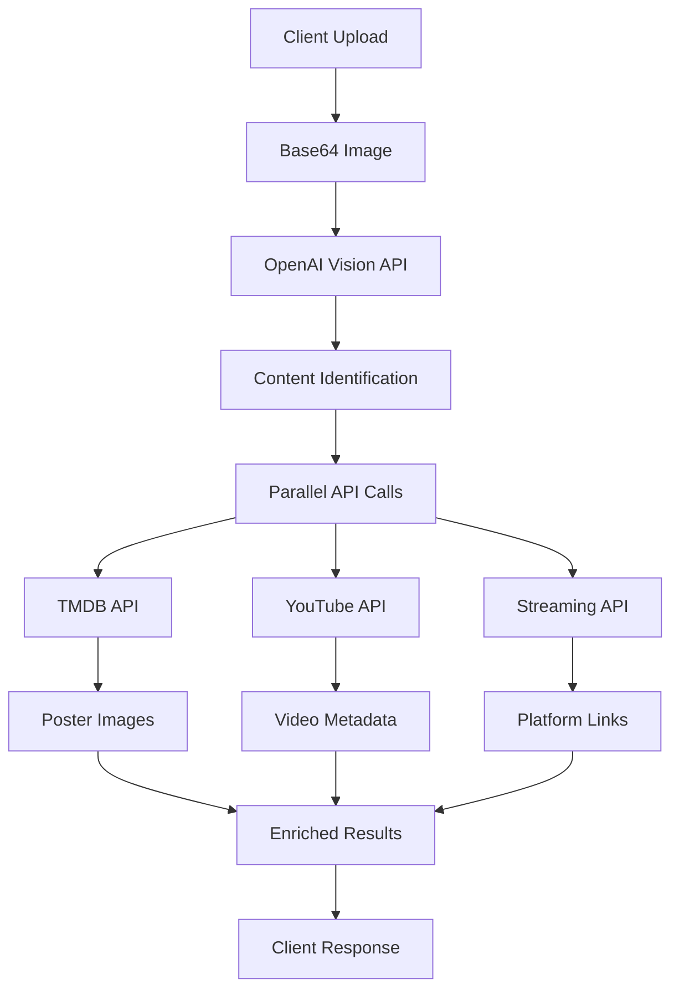

# Analyze Image Edge Function

## Overview

The `analyze-image` edge function is a sophisticated AI-powered image analysis service that identifies movies, TV shows, documentaries, and YouTube videos from uploaded images. It leverages OpenAI's Vision API for content recognition and enriches results with metadata from multiple external sources.

## Purpose

This function serves as the core engine for Visual Stream Finder's image-based content discovery feature. Users can upload screenshots, movie posters, scenes from shows, or any visual content, and the function will:

- Identify the content with high accuracy
- Fetch high-quality poster images
- Provide real-time streaming availability
- Return comprehensive metadata including ratings, genres, and plot summaries

## Architecture

### Function Flow



### API Integration Hierarchy

1. **Primary Analysis**: OpenAI Vision API (GPT-4o)
2. **Metadata Enhancement**: TMDB API
3. **Video Validation**: YouTube Data API v3
4. **Streaming Data**: Streaming Availability API

## API Integrations

### OpenAI Vision API

**Purpose**: Core image analysis and content identification

**Configuration**:
- Model: `gpt-4o`
- Max tokens: 1000
- Temperature: 0.7

**Capabilities**:
- Identifies multiple content types (movies, TV shows, documentaries, YouTube videos)
- Handles upcoming releases and recent titles (2024-2025)
- Returns structured JSON with confidence scores
- Supports franchise recognition and series identification

### TMDB API (The Movie Database)

**Purpose**: Fetches high-quality posters and enriched metadata

**Endpoints Used**:
- `/3/search/movie` - Movie title search
- `/3/search/tv` - TV show title search
- `/3/genre/movie/list` - Movie genre mapping
- `/3/genre/tv/list` - TV genre mapping

**Features**:
- High-resolution poster images (w500 size)
- Vote averages and popularity scores
- Release dates and genre classifications
- Fallback to Unsplash placeholders

### YouTube Data API v3

**Purpose**: Validates and enriches YouTube video identification

**Endpoints Used**:
- `/v3/search` - Search videos by title
- `/v3/videos` - Get detailed video information

**Features**:
- Actual video title verification
- Channel name extraction
- Maximum resolution thumbnail retrieval
- Direct YouTube URL generation

### Streaming Availability API

**Purpose**: Real-time streaming platform availability

**Configuration**:
- Provider: RapidAPI
- Region: US
- Output language: English

**Features**:
- Current streaming availability across 15+ platforms
- Rental and purchase options with pricing
- Direct deep links to content
- Service logos and branding

## Request/Response Format

### Request Schema

```typescript
interface AnalyzeImageRequest {
  imageBase64: string;  // Base64-encoded image data (max 10MB)
}
```

### Response Schema

```typescript
interface AnalyzeImageResponse {
  results: ContentResult[];
}

interface ContentResult {
  title: string;
  year: number;
  type: 'movie' | 'tv' | 'documentary' | 'youtube';
  genre: string[];
  rating: number;        // 0-10 scale
  runtime: string;       // Format: "XXm" or "X seasons"
  plot: string;
  poster: string;        // URL to poster image
  streamingSources: StreamingSource[];
  confidence: number;    // 0-1 scale
  releaseDate: string;
  youtubeUrl?: string;   // For YouTube content
  channelName?: string;  // For YouTube content
}

interface StreamingSource {
  name: string;          // Service name (e.g., "Netflix")
  logo: string;          // Service logo URL
  url: string;           // Direct link to content
  type: 'subscription' | 'rent' | 'buy' | 'free';
  price?: string;        // For rent/buy options
}
```

## Environment Variables

```bash
# Required
OPENAI_API_KEY=sk-...                    # OpenAI API key for Vision
TMDB_API_KEY=...                         # TMDB API key
STREAMING_AVAILABILITY_API_KEY=...       # RapidAPI key

# Optional
YOUTUBE_API_KEY=...                      # YouTube Data API v3 key
```

## Error Handling

### Input Validation
- **File Size**: Maximum 10MB enforced server-side
- **Format**: Base64 string validation
- **CORS**: Full preflight handling for cross-origin requests

### API Failure Handling

| API | Failure Strategy |
|-----|-----------------|
| OpenAI | Returns error with 500 status |
| TMDB | Falls back to Unsplash placeholder images |
| YouTube | Skips YouTube enhancement, continues |
| Streaming | Returns empty streaming sources array |

### Response Parsing
- Robust JSON extraction from OpenAI responses
- Markdown code block removal (`json` tags)
- Fallback to empty results array on parse failure

## Performance Optimizations

### Parallel Processing
- TMDB searches run concurrently for all identified content
- YouTube validations processed in parallel
- Streaming availability fetched simultaneously

### Caching Strategy
- No server-side caching (stateless function)
- Client-side caching via React Query
- CDN caching for static poster images

### Response Time
- Average: 3-5 seconds
- Timeout: 30 seconds (Supabase default)
- Streaming response supported

## Usage Example

### Client-Side Implementation

```javascript
// Upload and analyze image
const analyzeImage = async (file) => {
  // Convert to base64
  const reader = new FileReader();
  const base64 = await new Promise((resolve) => {
    reader.onloadend = () => resolve(reader.result);
    reader.readAsDataURL(file);
  });

  // Call edge function
  const response = await fetch(
    `${SUPABASE_URL}/functions/v1/analyze-image`,
    {
      method: 'POST',
      headers: {
        'Content-Type': 'application/json',
        'Authorization': `Bearer ${SUPABASE_ANON_KEY}`
      },
      body: JSON.stringify({
        imageBase64: base64.split(',')[1]
      })
    }
  );

  return response.json();
};
```

### Response Processing

```javascript
const processResults = (response) => {
  response.results.forEach(content => {
    console.log(`Found: ${content.title} (${content.year})`);
    console.log(`Confidence: ${content.confidence * 100}%`);
    
    content.streamingSources.forEach(source => {
      console.log(`Available on ${source.name}: ${source.url}`);
    });
  });
};
```

## Testing

### Local Development

```bash
# Start Supabase locally
npx supabase start

# Set environment variables
export OPENAI_API_KEY=your_key
export TMDB_API_KEY=your_key
export STREAMING_AVAILABILITY_API_KEY=your_key

# Serve function locally
npx supabase functions serve analyze-image --env-file ./supabase/.env.local

# Test with curl
curl -X POST http://localhost:54321/functions/v1/analyze-image \
  -H "Content-Type: application/json" \
  -d '{"imageBase64": "..."}'
```

### Test Scenarios

1. **Movie Poster**: Upload clear movie poster image
2. **TV Show Scene**: Screenshot from a TV episode
3. **YouTube Thumbnail**: YouTube video thumbnail
4. **Multiple Content**: Image with multiple recognizable items
5. **Low Quality**: Blurry or partial images
6. **Non-Content**: Images without identifiable media

## Limitations

1. **File Size**: 10MB maximum upload size
2. **Region**: Streaming data limited to US services
3. **Rate Limits**: Subject to external API quotas
4. **Language**: English-only content identification
5. **Accuracy**: Dependent on image quality and clarity

## Security Considerations

1. **JWT Verification**: Disabled (`verify_jwt = false`)
2. **CORS**: Wildcard allowed for development
3. **API Keys**: Stored in Supabase secrets
4. **Input Sanitization**: Base64 validation only
5. **No Data Persistence**: Images not stored

## Monitoring & Debugging

### Logging Points
- OpenAI API response
- TMDB search results
- Streaming availability hits
- Error conditions

### Common Issues

| Issue | Cause | Solution |
|-------|-------|----------|
| No results | Poor image quality | Request better image |
| Wrong identification | Ambiguous content | Add text search fallback |
| Missing streaming | API limit reached | Check API quotas |
| Slow response | Multiple API calls | Implement caching |

## Future Enhancements

1. **Multi-language Support**: Identify content in other languages
2. **Batch Processing**: Handle multiple images simultaneously
3. **Historical Data**: Track previously identified content
4. **Regional Streaming**: Support international streaming services
5. **OCR Integration**: Extract text from images for better accuracy
6. **Video Frame Analysis**: Support video file uploads

## Related Documentation

- [Search Content Function](./search-content.md) - Text-based content search
- [Streaming Icons Configuration](../streaming-icons.md) - Service branding
- [AI Analysis Service](../services/ai-analysis.md) - Frontend integration