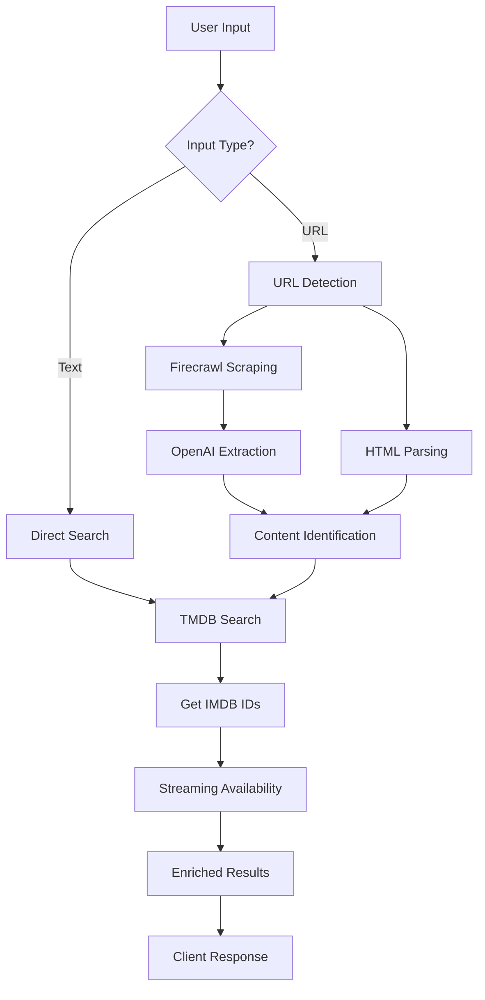
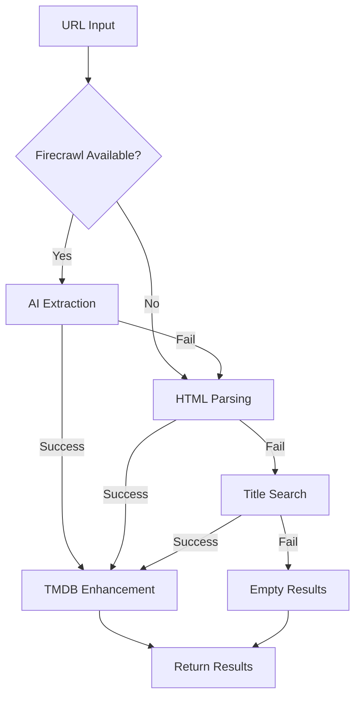

# Search Content Edge Function

## Overview

The `search-content` edge function is an intelligent content discovery service that identifies movies and TV shows through text queries or streaming platform URLs. It combines traditional search with AI-powered web scraping to extract content information from any streaming service URL.

## Purpose

This function provides flexible content discovery through multiple pathways:

- **Text Search**: Direct title searches with fuzzy matching
- **URL Intelligence**: Automatic content extraction from streaming platform URLs
- **AI Enhancement**: Smart content identification using web scraping and LLM analysis
- **Multi-Source Data**: Aggregates data from TMDB, streaming APIs, and web sources

## Architecture

### Function Flow



### Search Strategy Hierarchy

1. **URL Processing**: Firecrawl + AI extraction
2. **Fallback HTML**: Platform-specific parsers
3. **Text Search**: TMDB API with fuzzy matching
4. **Streaming Enhancement**: Real-time availability data

## API Integrations

### TMDB API (The Movie Database)

**Purpose**: Primary content search and metadata provider

**Endpoints Used**:
- `/3/search/movie` - Movie title search
- `/3/search/tv` - TV show title search
- `/3/movie/{id}/external_ids` - Get IMDB ID for movies
- `/3/tv/{id}/external_ids` - Get IMDB ID for TV shows
- `/3/genre/movie/list` - Movie genre mapping
- `/3/genre/tv/list` - TV genre mapping

**Features**:
- Fuzzy title matching
- Multi-language support
- Comprehensive metadata (ratings, genres, plots)
- High-quality poster images

### Streaming Availability API

**Purpose**: Real-time streaming platform availability

**Endpoints Used**:
- `/shows/{imdb_id}` - Direct lookup by IMDB ID (preferred)
- `/shows/search/title` - Fallback title-based search

**Strategy**:
1. Try IMDB ID lookup first (most accurate)
2. Fall back to title search if needed
3. Handle multiple results with year matching

**Data Provided**:
- Available streaming services
- Rental/purchase options with pricing
- Direct deep links to content
- Service logos and branding

### Firecrawl API

**Purpose**: Intelligent web scraping for URL analysis

**Configuration**:
```javascript
{
  formats: ['markdown', 'html'],
  onlyMainContent: true,
  timeout: 30000,
  waitFor: 2000
}
```

**Features**:
- JavaScript rendering support
- Main content extraction
- Markdown and HTML output
- Automatic wait for dynamic content

### OpenAI API

**Purpose**: AI-powered content extraction from web pages

**Configuration**:
- Model: `gpt-4o-mini` (cost-optimized)
- Max tokens: 500
- Temperature: 0.3 (focused responses)

**Task**: Extract structured movie/TV information from scraped content

## Supported Streaming Platforms

### URL Pattern Recognition

| Platform | URL Patterns | Extraction Method |
|----------|-------------|-------------------|
| Netflix | netflix.com/title/ | AI + HTML fallback |
| Prime Video | amazon.com/gp/video/, primevideo.com | AI + HTML fallback |
| Disney+ | disneyplus.com | AI extraction |
| HBO Max/Max | max.com, hbomax.com | Path-based + AI |
| Hulu | hulu.com | AI extraction |
| Peacock | peacocktv.com | AI extraction |
| Apple TV+ | tv.apple.com | AI extraction |
| Paramount+ | paramountplus.com | AI extraction |
| IMDB | imdb.com/title/ | Regex extraction |

### Platform-Specific Parsers

#### IMDB Parser
```javascript
// Extracts from URLs like: imdb.com/title/tt1234567/
const imdbId = url.match(/title\/(tt\d+)/)?.[1];
const title = html.match(/<title>([^(]+)/)?.[1];
const year = html.match(/\((\d{4})[^)]*\)/)?.[1];
```

#### HBO Max/Max Parser
```javascript
// Detects content type from URL path
const isMovie = url.includes('/feature/');
const isSeries = url.includes('/series/');
```

## Request/Response Format

### Request Schema

```typescript
interface SearchContentRequest {
  query: string;  // Text query or streaming platform URL
}
```

### Response Schema

```typescript
interface SearchContentResponse {
  results: ContentResult[];
}

interface ContentResult {
  title: string;
  year: number;
  type: 'movie' | 'tv' | 'documentary';
  genre: string[];
  rating: number;        // 0-10 scale
  runtime: string;       // Format: "XXm" or "X seasons"
  plot: string;
  poster: string;        // URL to poster image
  streamingSources: StreamingSource[];
  confidence: number;    // 0.7-0.9 scale
  releaseDate: string;
}

interface StreamingSource {
  name: string;          // Service name
  logo: string;          // Service logo URL
  url: string;           // Direct link or search URL
  type: 'subscription' | 'rent' | 'buy' | 'free';
  price?: string;        // For rent/buy options
}
```

## Environment Variables

```bash
# Required
TMDB_API_KEY=...                         # TMDB API key
STREAMING_AVAILABILITY_API_KEY=...       # RapidAPI key

# Optional (for URL processing)
FIRECRAWL_API_KEY=...                   # Firecrawl API key
OPENAI_API_KEY=sk-...                   # OpenAI API key
```

## Search Strategies

### Text Query Processing

1. **Direct TMDB Search**:
   - Search both movies and TV shows
   - Sort by popularity and vote count
   - Apply year filtering if provided

2. **Result Ranking**:
   - Exact title matches ranked first
   - Higher vote counts prioritized
   - Recent releases weighted higher

3. **Deduplication**:
   - Remove duplicates by title + year
   - Prefer movie over TV for same title

### URL Processing Workflow

1. **Service Detection**:
   ```javascript
   const service = detectStreamingService(url);
   ```

2. **AI Extraction** (if Firecrawl available):
   ```javascript
   const scraped = await firecrawl.scrape(url);
   const extracted = await openai.extract(scraped);
   ```

3. **HTML Fallback**:
   ```javascript
   const parsed = await parseHTMLContent(html, service);
   ```

4. **TMDB Enhancement**:
   ```javascript
   const enriched = await searchTMDB(extracted.title);
   ```

## Error Handling

### Cascading Fallback Strategy



### Error Responses

| Error Type | Status | Response |
|------------|--------|----------|
| Missing query | 400 | "Query parameter is required" |
| API failure | 200 | Empty results array |
| Parse error | 200 | Fallback to next strategy |
| Timeout | 200 | Partial results returned |

## Performance Optimizations

### Caching Strategy
- No server-side caching (stateless)
- Client-side React Query caching
- Browser URL result caching

### Parallel Processing
- Concurrent TMDB movie/TV searches
- Simultaneous IMDB ID fetching
- Parallel streaming API calls

### Response Times
- Text search: 1-2 seconds
- URL with AI: 5-8 seconds
- URL with HTML: 2-3 seconds

## Usage Examples

### Text Search

```javascript
const searchByTitle = async (title) => {
  const response = await fetch(
    `${SUPABASE_URL}/functions/v1/search-content`,
    {
      method: 'POST',
      headers: {
        'Content-Type': 'application/json',
        'Authorization': `Bearer ${SUPABASE_ANON_KEY}`
      },
      body: JSON.stringify({
        query: title
      })
    }
  );
  
  return response.json();
};

// Usage
const results = await searchByTitle("The Matrix");
```

### URL Search

```javascript
const searchByURL = async (streamingUrl) => {
  const response = await fetch(
    `${SUPABASE_URL}/functions/v1/search-content`,
    {
      method: 'POST',
      headers: {
        'Content-Type': 'application/json',
        'Authorization': `Bearer ${SUPABASE_ANON_KEY}`
      },
      body: JSON.stringify({
        query: streamingUrl
      })
    }
  );
  
  return response.json();
};

// Usage
const results = await searchByURL("https://www.netflix.com/title/81234567");
```

## Testing

### Local Development

```bash
# Start Supabase
npx supabase start

# Set environment variables
export TMDB_API_KEY=your_key
export STREAMING_AVAILABILITY_API_KEY=your_key
export FIRECRAWL_API_KEY=your_key  # Optional
export OPENAI_API_KEY=your_key     # Optional

# Serve function
npx supabase functions serve search-content --env-file ./supabase/.env.local

# Test text search
curl -X POST http://localhost:54321/functions/v1/search-content \
  -H "Content-Type: application/json" \
  -d '{"query": "Inception"}'

# Test URL search
curl -X POST http://localhost:54321/functions/v1/search-content \
  -H "Content-Type: application/json" \
  -d '{"query": "https://www.netflix.com/title/70131314"}'
```

### Test Scenarios

1. **Popular Movie**: Search for well-known titles
2. **TV Series**: Search for TV show names
3. **Netflix URL**: Test Netflix content extraction
4. **IMDB URL**: Test IMDB ID extraction
5. **Ambiguous Title**: Test deduplication
6. **New Release**: Test recent content
7. **Invalid URL**: Test error handling

## Advanced Features

### Intelligent Title Extraction

The function uses multiple strategies to extract titles:

1. **AI Understanding**: GPT-4 comprehends context
2. **Meta Tags**: Open Graph and Twitter cards
3. **JSON-LD**: Structured data extraction
4. **Regex Patterns**: Platform-specific patterns
5. **DOM Parsing**: Title element extraction

### Multi-Result Handling

When multiple matches are found:
- Returns up to 5 most relevant results
- Confidence scoring based on:
  - Title similarity
  - Year matching
  - Vote count
  - Popularity score

### Deep Linking

Generates platform-specific deep links:
- Direct content pages when available
- Search results as fallback
- Mobile app URLs where supported

## Limitations

1. **URL Support**: Limited to major streaming platforms
2. **Region**: US streaming data only
3. **Rate Limits**: Subject to API quotas
4. **AI Dependency**: URL extraction requires API keys
5. **Dynamic Content**: Some platforms require JavaScript rendering

## Security Considerations

1. **Input Validation**: URL and query sanitization
2. **API Key Protection**: Server-side only
3. **CORS Policy**: Controlled access
4. **No Data Storage**: Stateless processing
5. **Error Masking**: Internal errors not exposed

## Monitoring & Debugging

### Key Metrics
- Search query distribution
- URL platform breakdown
- API success rates
- Response times by strategy

### Common Issues

| Issue | Cause | Solution |
|-------|-------|----------|
| No URL results | Missing API keys | Add Firecrawl/OpenAI keys |
| Wrong content | Title ambiguity | Add year to search |
| Slow response | AI processing | Use text search instead |
| Missing streaming | No IMDB ID | Improve title matching |

## Future Enhancements

1. **Browser Extension**: Direct extraction from streaming tabs
2. **Batch Processing**: Multiple URLs in single request
3. **International Support**: Non-US streaming services
4. **Watch Party Links**: Generate shareable viewing sessions
5. **Price Tracking**: Historical pricing data
6. **Availability Alerts**: Notify when content becomes available

## Related Documentation

- [Analyze Image Function](./analyze-image.md) - Image-based search
- [Streaming Icons Configuration](../streaming-icons.md) - Service branding
- [Watchlist Service](../services/watchlist.md) - Content management