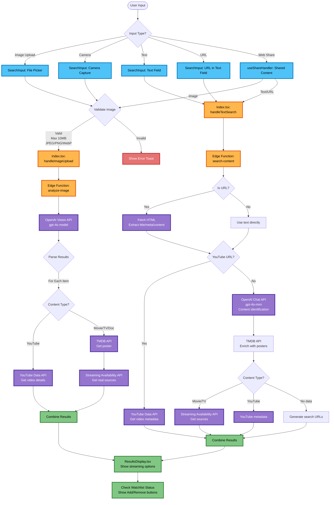
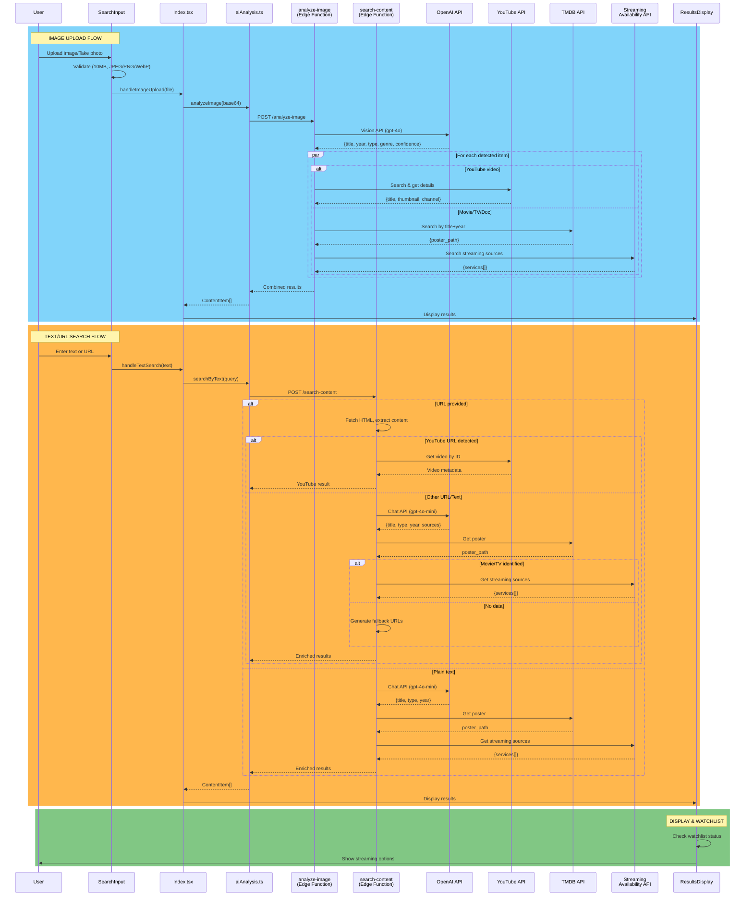

# Search Workflow Architecture

This document provides a comprehensive overview of the Visual Stream Finder search architecture, including all input types, processing paths, and API integrations.

## Overview

Visual Stream Finder supports multiple search input methods, each with its own optimized processing pipeline:

1. **Image Upload** - File picker for image selection
2. **Camera Capture** - Direct camera access for real-time photos
3. **Text Search** - Plain text queries for movie/TV titles
4. **URL Input** - URLs from IMDb, streaming platforms, YouTube, etc.
5. **Web Share** - Integration with native share functionality

All search methods ultimately route through one of two edge functions:
- `analyze-image` - Optimized for visual content analysis
- `search-content` - Optimized for text/URL processing

## Complete Search Flow Diagram



## Detailed API Interaction Sequence



## Key Differences Between Search Paths

### Image Upload/Camera → `analyze-image` Edge Function

**Characteristics:**
- **AI Model**: OpenAI Vision (gpt-4o) - Premium model optimized for image understanding
- **Cost**: Higher per request (~$0.01-0.03 per image)
- **Confidence**: Returns scores from 0.6 to 1.0 based on visual clarity
- **Processing**: Can detect multiple items in a single image (parallel processing)
- **Use Cases**: Screenshots, photos of posters, TV screens, promotional materials

**API Call Sequence:**
1. OpenAI Vision API for content identification
2. For YouTube content: YouTube Data API (search + details)
3. For movies/TV: TMDB API (posters) + Streaming Availability API (sources)

**Files:**
- Frontend: `src/components/SearchInput.tsx` (lines 98-136)
- Controller: `src/pages/Index.tsx` (handleImageUpload, lines 42-76)
- Edge Function: `supabase/functions/analyze-image/index.ts`

### Text/URL Input → `search-content` Edge Function

**Characteristics:**
- **AI Model**: OpenAI Chat (gpt-4o-mini) - Cost-effective model for text processing
- **Cost**: Lower per request (~$0.001-0.003 per query)
- **Confidence**: Maps text confidence (high/medium/low) to 0.95/0.8/0.6
- **Processing**: Single item per request, but faster response times
- **Use Cases**: Title searches, IMDb links, streaming platform URLs, YouTube URLs

**Special Features:**
- **URL Detection**: Regex pattern `/^https?:\/\/.+/` automatically extracts web content
- **YouTube Optimization**: Direct video ID extraction from YouTube URLs bypasses AI analysis
- **HTML Parsing**: Extracts `<title>`, `<meta description>`, and first 2000 chars for context
- **Fallback Strategy**: Generates search URLs when streaming APIs return no data

**API Call Sequence:**
1. If URL: Fetch HTML content
2. If YouTube URL: Direct YouTube Data API call (skip AI)
3. Otherwise: OpenAI Chat API for identification
4. TMDB API for poster enrichment
5. Streaming Availability API for sources (or generate fallback URLs)

**Files:**
- Frontend: `src/components/SearchInput.tsx` (lines 138-152)
- Controller: `src/pages/Index.tsx` (handleTextSearch, lines 78-112)
- Edge Function: `supabase/functions/search-content/index.ts`

### Web Share Integration → Routes to Appropriate Handler

**Characteristics:**
- **Platform Support**: iOS Safari, Android Chrome, native mobile apps
- **Content Types**: Handles both shared images and shared text/URLs
- **Routing**: Automatically detects content type and routes to correct edge function

**Files:**
- Hook: `src/hooks/useShareHandler.ts`
- Controller: `src/pages/Index.tsx` (lines 120-146)

## API Reference

| API | Edge Function | Purpose | Authentication | Rate Limits |
|-----|---------------|---------|----------------|-------------|
| **OpenAI Vision API** | analyze-image | Image content identification | `OPENAI_API_KEY` | Token-based pricing |
| **OpenAI Chat API** | search-content | Text content identification | `OPENAI_API_KEY` | Token-based pricing |
| **YouTube Data API v3** | Both | Video metadata & thumbnails | `YOUTUBE_API_KEY` | 10,000 units/day |
| **TMDB API v3** | Both | Movie/TV posters | `TMDB_API_KEY` | 50 requests/sec |
| **Streaming Availability** | Both | Real streaming platform data | `STREAMING_AVAILABILITY_API_KEY` (RapidAPI) | Plan-dependent |

## Component Architecture

### Frontend Layer

| Component | Responsibility | Key Methods |
|-----------|----------------|-------------|
| `SearchInput.tsx` | User input handling | `onImageUpload`, `onTextSearch`, camera controls |
| `Index.tsx` | Request routing | `handleImageUpload`, `handleTextSearch` |
| `ResultsDisplay.tsx` | Results presentation | Watchlist integration, streaming links |
| `useShareHandler.ts` | Web Share API | Parse shared content, route to handlers |

### Service Layer

| Service | Responsibility | Methods |
|---------|----------------|---------|
| `aiAnalysis.ts` | API client for edge functions | `analyzeImage()`, `searchByText()` |
| `watchlistService.ts` | Watchlist CRUD operations | Add, remove, toggle watched status |

### Edge Functions

| Function | Primary Use | Secondary Features |
|----------|-------------|-------------------|
| `analyze-image` | Visual content analysis | Multi-item detection, parallel processing |
| `search-content` | Text/URL processing | YouTube optimization, HTML extraction, fallback generation |

## Validation & Error Handling

### Image Upload Validation
```typescript
// src/components/SearchInput.tsx (lines 98-111)
- Max file size: 10MB
- Allowed formats: JPEG, PNG, WebP
- Base64 encoding validation in edge function
```

### URL Detection
```typescript
// src/components/SearchInput.tsx (line 145)
const urlRegex = /^https?:\/\/.+/
// Matches: http://, https:// followed by any characters
```

### Confidence Score Mapping
```typescript
// analyze-image: 0.6 to 1.0 (from AI model)
// search-content:
//   - "high" → 0.95
//   - "medium" → 0.8
//   - "low" → 0.6
```

## Performance Considerations

### Image Path Optimizations
- **Parallel Processing**: Multiple detected items processed simultaneously
- **Image Compression**: 10MB limit balances quality with upload speed
- **Base64 Caching**: Client-side preview prevents redundant encoding

### Text Path Optimizations
- **YouTube Fast Path**: Direct API call for YouTube URLs (bypasses AI analysis)
- **Cost Efficiency**: Uses gpt-4o-mini instead of gpt-4o (10x cheaper)
- **Graceful Degradation**: Fallback URLs generated when APIs fail
- **HTML Extraction**: Limited to 2000 chars to reduce token usage

## Future Enhancement Opportunities

Based on the current architecture, potential improvements include:

1. **Caching Layer**: Redis/CloudFlare cache for repeated searches
2. **Batch Processing**: Multiple images in single request
3. **Streaming Results**: Progressive UI updates as APIs respond
4. **Offline Mode**: Cache recent searches for offline access
5. **A/B Testing**: Compare gpt-4o vs gpt-4o-mini accuracy for images

## Related Documentation

- [Analyze Image Edge Function](/docs/edge-functions/analyze-image.md)
- [Search Content Edge Function](/docs/edge-functions/search-content.md)
- [Search Content OpenAI Integration](/docs/edge-functions/search-content-update.md)
- [Search Content Logging Improvements](/docs/edge-functions/search-content-logging-improvement.md)
